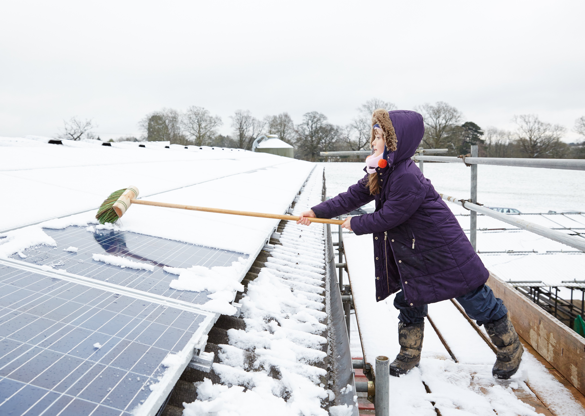
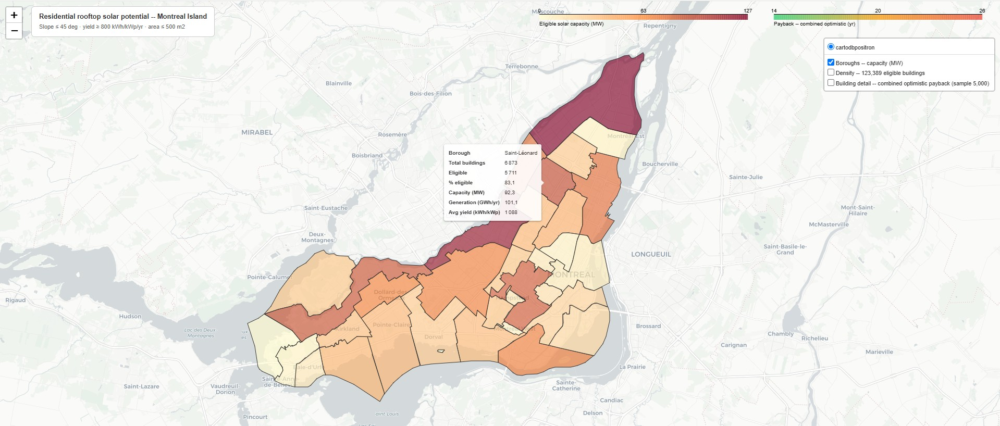

Python
rasterio
GIS
XGBoost

# How Much Solar Power Is Montreal Leaving on the Roof?

**GitHub**: [p-brunet/solar-potential-MTL](https://github.com/p-brunet/solar-potential-MTL)

## Overview

I grew up near Toulouse, in southern France, where solar panels are just part of the roofline — farm sheds, barns, plenty of houses too, encouraged for years by a feed-in tariff that paid up to **12.69 c€/kWh** for surplus electricity sold back to the grid. Montreal, where I live now, doesn't feel like a solar city by comparison: cold winters (sometimes grey skies) and snow on rooftops for months. So the question that started this project was a simple one: **what about Montreal?** and especially the residential solar panels.

The physics turns out not to be the problem. Residential rooftops on the island receive enough sunlight to produce between **1,060 and 1,200 kWh/kWp per year** — comparable to Toulouse! Despite their completely different winter climates, both cities have a highly comparable annual solar production potential, with both generating roughly 1,150 to 1,300 kWh per kWp annually due to their similar latitudes and Montreal's cold-weather efficiency advantages.

Clearing panels after a snowfall. *Photo: 1010 Climate Action / Oliver Rudkin, CC BY 2.0*

Hydro-Québec already publishes a [decision-support tool](https://www.hydroquebec.com/residentiel/mieux-consommer/conseils/panneaux-solaires/outil-aide-decision.html) for homeowners weighing solar. It's useful, but it answers for one address at a time: pick a city, enter your consumption and panel count, and it assumes ideal orientation, brand-new equipment and zero shading. It can't say anything about the island as a whole, or where Hydro-Québec's own 3,000 MW 2035 rooftop solar target might actually come from. I wanted that aggregate answer — first for the island, then (maybe?) scale to the province.

To get there, I built an open-source pipeline using nothing but public data: a one-metre LiDAR elevation mosaic, municipal building footprints, and Hydro-Québec's published tariff structure. The pipeline extracts roof geometry for **419,000 residential buildings** across the island, simulates their annual solar yield, scales that simulation to every building with a surrogate model, and runs an economic analysis across policy scenarios.

## Data & Pipeline

Three public datasets make this possible:

::::{grid} 1 1 3 3

:::{card} NRCan HRDEM mosaic
Seamless 1m-resolution LiDAR elevation covering all of Canada, used to derive roof slope, orientation and a sky-view-factor shading proxy for every building.
:::

:::{card} Montreal building footprints
Municipal open data (GeoParquet via NRCan) providing the 419,000 residential polygons that anchor every downstream calculation.
:::

:::{card} Hydro-Québec tariffs
Published residential tariff D (7.3 c/kWh), the net-metering rules and the LogisVert subsidy structure, used to price every rooftop's economics.
:::

::::

The workflow runs in nine stages: geodata collection, roof geometry extraction from LiDAR, a stratified `pvlib` simulation on a 3,000-building sample, an XGBoost surrogate model to scale that simulation to all 419,000 buildings in minutes, borough-level aggregation, and finally economic and grid-impact modelling across policy scenarios.

## From 3,000 Simulations to 419,000 Buildings

Running a full `pvlib` simulation on every building would take weeks. Instead, `pvlib` yield is simulated for a stratified sample of 3,000 buildings, and an XGBoost model is trained to predict yield from four roof features — orientation (as `sin`/`cos` of azimuth), slope, and sky-view factor — then applied to the full dataset.

The surrogate holds up well against held-out `pvlib` ground truth: **R² = 0.997, RMSE = 14 kWh/kWp, MAPE = 1.0%** on 200 out-of-sample buildings.

None of this is a modelling breakthrough, and it isn't meant to be. Annual yield is close to a deterministic function of orientation, slope and location once climate is fixed, so fitting it from four inputs was never a hard prediction problem — a simpler regression would likely get most of the way there too. XGBoost's job here is boring on purpose: stand in for 416,000 `pvlib` runs that would otherwise take weeks, not uncover a pattern nothing simpler could find.

::::{grid} 1 1 2 2

:::{card} Surrogate vs. ground truth

Out-of-sample validation against `pvlib` simulations, coloured by roof slope.
:::

:::{card} Feature importance

Orientation (`cos_az`, `sin_az`) dominates; sky-view factor (`svf`) carries almost no weight.
:::

::::

That last chart is a useful negative result. The sky-view-factor proxy, meant to capture inter-building shading from neighbouring structures, turned out to carry no predictive signal — because the `pvlib` simulations used to generate training labels don't model neighbour shading in the first place, so the surrogate had nothing to learn from.

## Headline Numbers

Of the **420,000 residential rooftops** analyzed from LiDAR, **260,000 are physically eligible** — right slope, enough annual yield, under the footprint cap. Equip every one of them and the island's technical potential is **1,420 MW**, generating **1,576 GWh a year**. That's **47% of Hydro-Québec's entire province-wide 3,000 MW solar target for 2035 — from one city, in fact the largest in Québec province**.

The median eligible building tells the story at the individual scale: a **139 m² footprint**, an **8.9 kWp** system of roughly 22 panels at 400 W each, producing about **9,800 kWh a year**. South-facing pitched roofs hit 1,100–1,200 kWh/kWp, consistent with NRCan's solar atlas. Azimuth dominates the variance in that number far more than slope does — which runs against most people's intuition, since slope is the one homeowners tend to fixate on.

The borough breakdown has some surprises. **Saint-Léonard** comes out on top with 83% of buildings eligible — rows of 1960s–70s bungalows with 30° south-facing roofs, close to textbook solar geometry. **Westmount** has the highest median yield on the island. **Verdun** almost didn't show up at all: its 4,281 residential buildings were completely absent from the first results, because the individual NRCan LiDAR acquisition tiles had a genuine coverage gap over the borough. I spent several sessions debugging what I initially misdiagnosed as a missing-footprint problem before tracing it back to the elevation data — fixed by switching from individual tiles to NRCan's seamless HRDEM mosaic. A good reminder that public geospatial datasets have real holes in them, and that absence of data is easy to mistake for absence of signal.

## Explore the Map

The full borough-by-borough breakdown is easier to read than to describe — building-level eligibility, capacity and payback, rendered as an interactive `Folium` map. Borough colour is eligible capacity (MW); hovering any borough shows its building count, eligibility rate, generation and average yield — Saint-Léonard's tooltip is pictured below.

The live version is a heavy page — every eligible building's polygon is baked in — so it's a link rather than an in-page embed: [**open the interactive map →**](https://htmlpreview.github.io/?https://github.com/p-brunet/solar-potential-MTL/blob/main/data/outputs/solar_map.html)

## The Uncomfortable Part: Baseline Economics Are Bad

Take the median eligible building: an 8.9 kWp system, installed cost around **\$27,000**. The LogisVert grant covers its capped maximum, **\$6,000**. With net metering at Hydro-Québec's 7.3 c/kWh tariff, year-one savings come to **\$717**. Payback: **23 years**. NPV over the 25-year system life at a 5% discount rate: **-\$10,700**.

This is not a model flaw. It is the correct answer for Quebec in 2026. A dollar recovered in year 23 is worth roughly $0.30 today, and clearing a positive NPV over a 25-year horizon at a 5% discount rate takes a payback of roughly 15 years or better — nowhere close to 23. Hydro-Québec's own stated pre-subsidy baseline (25 to 30 years) is negative NPV *by definition*: a payback at or beyond a system's guaranteed life cannot produce a positive return at any positive discount rate.

::::{grid} 1 1 2 2

:::{card} Payback & NPV distribution

An earlier run of this chart, before the homeowner-only scenarios below — treat the shape as illustrative, not the exact current baseline.
:::

:::{card} Sensitivity to tariff escalation

Median NPV vs. annual tariff escalation rate. HQ's own estimated need (~5%/yr) still isn't enough on its own.
:::

::::

Quebec's 7.3 c/kWh tariff is doing all of this work. Ontario (~13 c/kWh) and BC (~12 c/kWh) sit close to double it; Alberta's deregulated market has run higher still, if more volatile. The same rooftop hardware would be closer to — or past — that 15-year threshold in any of them today. Quebec's near-nonexistent residential solar market isn't a mystery; it's this arithmetic.

## Which Policy Levers Actually Move the Needle

This analysis now keeps strictly to the homeowner case — an owner-occupier, not a landlord or investor. An earlier version of this post mixed in landlord/investor scenarios assuming they'd benefit from self-consumption savings the same way an occupant would; that assumption doesn't hold — a landlord with individually-metered tenants typically has no Hydro-Québec account of their own at that address to net against in the first place — and modeling their economics as if they did was a mistake worth just dropping rather than patching.

| Scenario | Median payback | % NPV > 0 | Median NPV |
|---|---|---|---|
| No subsidy (Hydro-Québec's own stated range) | 25–30 yr | 0% | negative |
| LogisVert + net metering — Hydro-Québec's current offer | 23 yr | 0% | -\$10,700 |
| LogisVert + net metering + 5%/yr escalation | 21 yr | 0% | -\$7,100 |

None of them clears zero. Worth flagging: the LogisVert grant isn't hypothetical — Hydro-Québec [announced almost exactly this program](https://news.hydroquebec.com/news/press-releases/all-quebec/hydro-qubec-announces-new-grant-to-accelerate-solar-self-generation.html) in April 2026, and states it's expected to cut payback "from 25 to 30 years... to some 10 to 12 years." Row two here is the fair, apples-to-apples comparison — homeowner, the actual subsidy, full net metering — and it lands at **23 years**, not 10–12.

Row three adds a faster tariff escalation (5%/yr). It's a clean illustration of a distinction worth keeping straight: 75.5% of buildings in that scenario recover their capital somewhere within the 25-year system life — but essentially none of them (12 buildings, effectively 0%) actually clear a positive NPV, clustering around a 21-year payback that's still too slow to beat the discount hurdle. Recovering your capital and making a good investment are not the same claim.

### The Grant Cap Creates Two Populations

The LogisVert grant isn't a flat percentage — it's $1,000/kW, capped at 40% of eligible costs **or $6,000 absolute, whichever is lower**. Below roughly 5 kWp, most systems still get the full 40%-of-cost rate. Above that — which includes the median 8.9 kWp building above — every system gets the same flat $6,000 regardless of how much bigger it is, so the grant's impact per kWp shrinks as the system grows. That design choice shows up directly in the NPV distribution as two distinct modes, not one smooth curve. Worth naming as a program design choice, not a bug: LogisVert is proportionally far more generous to smaller systems than to larger ones.

### The Regulatory Reality Right Now

The 3%/yr tariff escalation used as this analysis's baseline isn't a guess — it's currently law. Government Decree 1239-2025 hard-caps residential tariff increases at 3%/yr through 2028; the Régie de l'énergie has approved 3% for 2026–27 and 2.6% for 2028. Hydro-Québec pushed back hard against the decision, calling it a threat to its Action Plan 2035, and had roughly $450M in claimed costs rejected outright by the Régie.

That cap is politically enforced today, but structurally fragile. Hydro-Québec says it needs \$155–185 billion in investment by 2035, and the Régie isn't currently recognizing the full cost base behind that number. Something has to give eventually — either the investment plan shrinks or the tariff cap does. Row three's 5%/yr escalation is a bet on which way that resolves.

Hydro-Québec's own solar-costs page frames the 10–12 year payback figure explicitly as a **2035** outcome, not a claim about today — and this model can now say what has to happen to get there, simultaneously: installed cost needs to fall from today's \$3.00/W to roughly **\$1.80/W** (a 5%/yr decline, in line with the historical global trend for solar hardware), and the tariff needs to keep climbing from 7.3 c/kWh toward roughly **10 c/kWh** (3%/yr sustained for about a decade — already locked in through 2028 by Decree 1239-2025, and assumed, not guaranteed, to continue past it). Neither change alone gets there. Together, they land the median homeowner at roughly **12 years** — squarely inside Hydro-Québec's stated range.

Put plainly: **Quebec residential solar is currently a bet on 2035**, not a positive-NPV investment today. Installing now means accepting that trade explicitly, in exchange for early adoption and whatever non-financial value you place on energy independence.

### A Precedent for Bold Policy

The scale of intervention needed isn't hypothetical. In July 2026, Hydro-Québec and the Government of Quebec announced a joint program giving **20,000 lower-income households** free energy-efficient renovations — including heat pump installations — backed by more than **$243M CAD** in investment. For eligible families, that means more comfort at home, a lighter electricity bill, and better resilience through both heat waves and cold snaps.

It's a useful precedent. It shows that when the political will is there, Hydro-Québec and the provincial government can move quickly and generously on household-level energy programs — just on the demand side (efficiency, heat pumps) rather than the supply side (rooftop generation) this analysis is about. The tariff and net-metering structure driving 0% NPV-positive buildings today is a policy choice, not a law of physics, and this program is proof that comparable ambition is politically available when the will exists.

## Grid-Scale Impact

The 1,420 MW / 47%-of-target figure above is the technical ceiling — every eligible rooftop, equipped. A more realistic near-term marker: at 30% rooftop penetration, Montreal could install **426 MW** — 14.2% of Hydro-Québec's province-wide 2035 rooftop solar target of 3,000 MW. Allocated proportionally by population, Montreal's implicit share of that target is around 750 MW, so 30% penetration gets the island to roughly 57% of its fair share. Achievable — but only with policy that makes the investment worthwhile for individual homeowners, which the current tariff structure does not.

## Limitations

Everything here is simulated. No measured production data from actual Montreal installations was used to validate the yield estimates. Roof condition, tree shading at the property boundary, and equipment obstructions are not modelled. The economics are scoped to owner-occupiers only. That's a real gap for rental properties, not something this post's numbers speak to at all. As noted above, the inter-building shading proxy carries no predictive signal, since the underlying `pvlib` simulations don't model neighbour shading either.

One more caveat specific to the economics: Tariff D is tiered, not flat — roughly 7 c/kWh for the first ~15,000 kWh/year and about 12 c/kWh above that — while this analysis prices every avoided, behind-the-meter kWh at a single blended average (7.3 c/kWh). That likely understates the value of self-consumption for higher-usage households and slightly overstates it for very low-usage ones. Hydro-Québec's self-generation framework is also moving fast — the net-metering capacity cap was raised from 50 kW to 1 MW only in the past few months — so the tariff and program constants used throughout this post are a snapshot of a fast-changing target, not a stable baseline. Check Hydro-Québec's current rate sheet before drawing conclusions for a real installation.

## Closing the Loop: What About Toulouse?

I opened with Toulouse's feed-in tariff as the reason its rooftops look so different from Montreal's. As of an [arrêté dated June 1, 2026](https://www.hellowatt.fr/panneaux-solaires-photovoltaiques/tarif-rachat-photovoltaique), France collapsed that same rate from 12.69 c€/kWh down to **1.1 c€/kWh** for installations under 100 kWc — a reform that landed while this analysis was underway. A Quebec homeowner on net metering, credited at the full 7.3 c/kWh retail tariff, now gets several times more value per exported kWh than a French rooftop does today. The lesson isn't that Montreal's tariff structure is uniquely bad — it's that the compensation rate for exported solar is a policy dial anyone can turn, in either direction, and it moves the economics of every rooftop under it.

## One Last Thing: Who's Climbing Up There to Clear the Snow?

Nobody, ideally. The photo near the top of this post makes the question obvious, and it turns out there's a whole toolkit for answering it without a ladder. A steep tilt — 30° and up, exactly what Saint-Léonard's bungalow stock happens to offer — sheds snow by gravity within a day or two of sun, no intervention needed. For the rest, a ground-operated snow rake handles it from the yard. Some installations go further with self-heating panels or embedded heating cables that melt a snow load off directly, at the cost of a few percent of annual output diverted to run them.

There's even a small silver lining buried in here: bifacial panels — the kind that generate from both faces — actually benefit from snow on the *ground* around them, since fresh snow's high albedo bounces extra light onto the underside of the panel. Snow sitting on the panel is a straightforward loss; snow sitting next to it is a minor bonus. Montreal, it turns out, has both in abundance.

## Stack

| Tool | Role |
|------|------|
| `rasterio` | LiDAR raster loading and roof geometry extraction |
| `GeoPandas` | Building footprint and borough polygon processing |
| `pvlib` | Physical solar yield simulation (stratified sample) |
| `XGBoost` | Surrogate model scaling yield to all 419,000 buildings |
| `SHAP` | Surrogate model feature attribution |
| `Folium` | Interactive borough-level map |
| `uv` | Dependency management and reproducible environment |

## Source Code

[github.com/p-brunet/solar-potential-MTL](https://github.com/p-brunet/solar-potential-MTL)

Run everything from public datasets using `uv sync`.
